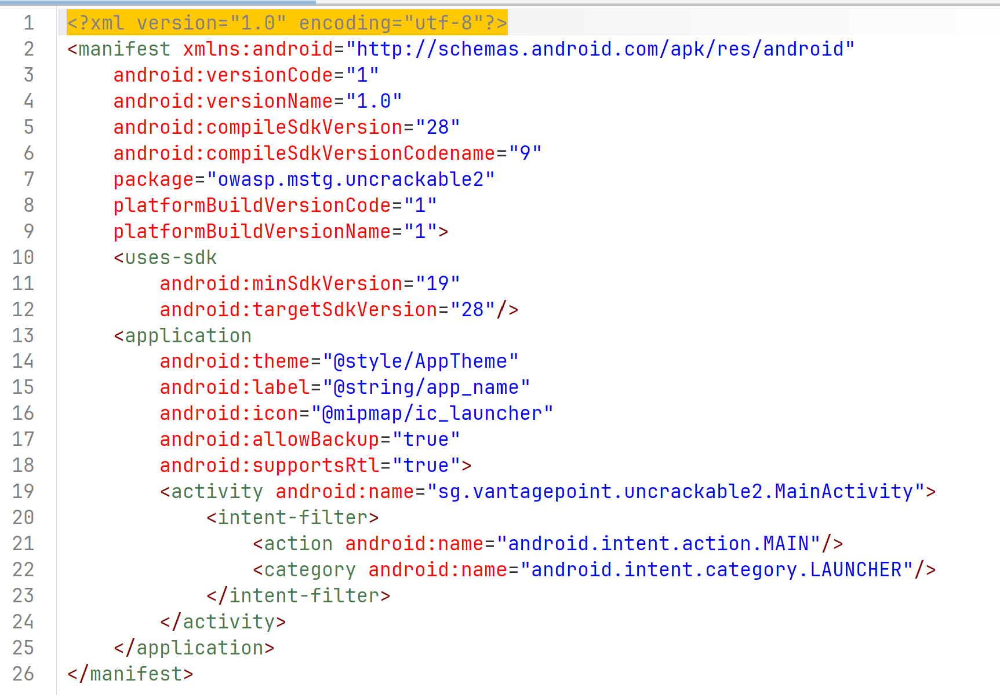
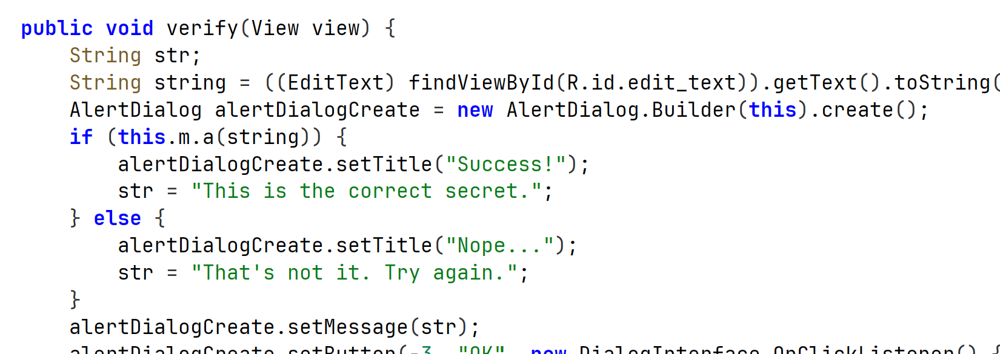
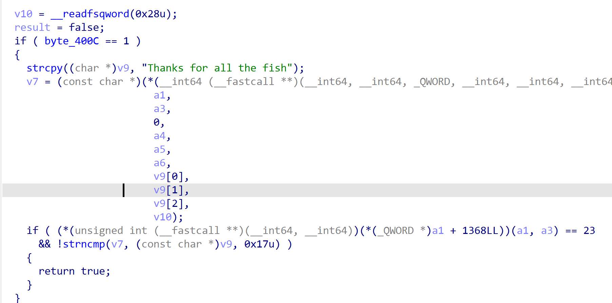

## LAB 5 : Reverse Engineering de UnCrackable Level 2

## Objectifs pédagogiques

Dans ce laboratoire, l’objectif est d’apprendre à analyser une application Android qui cache sa logique importante dans une bibliothèque native. L’application semble simple : un champ de texte permet de saisir une valeur, puis un bouton déclenche une vérification. Pourtant, cette vérification n’est pas entièrement visible dans le code Java. Le write-up analysé montre que la chaîne saisie dans l’interface est transmise depuis MainActivity à un objet CodeCheck, qui charge une bibliothèque native via System.loadLibrary("foo") puis appelle une méthode JNI nommée bar. Cette fonction native effectue ensuite une comparaison de chaînes avec strncmp, ce qui mène à la récupération du secret.

Ce lab a été enrichi pour être plus simple et plus progressif. Chaque étape explique ce qu’il faut faire, ce qu’il faut observer, pourquoi cela compte, et où placer les captures d’écran dans un support pédagogique ou un compte rendu.

---


À la fin du lab, il sera possible de :
Comprendre le rôle d’un APK dans Android
Observer le comportement d’une application avant de lire son code
Identifier le point de départ d’une vérification dans MainActivity
Reconnaître le chargement d’une bibliothèque native avec System.loadLibrary
Comprendre le principe d’une méthode native en Java
Localiser un fichier .so dans un APK Android
Ouvrir une bibliothèque native dans Ghidra
Retrouver une fonction JNI exportée
Repérer une comparaison de chaînes avec strncmp
Décoder une valeur hexadécimale ASCII
Retrouver le secret final et le valider dans l’application

## Environnement & Outils Utilisés

| Outil | Rôle |
|-------|------|
| **JADX** | Décompilation du bytecode Java/Dalvik (.apk → .java) |
| **IDA Pro** | Analyse statique de la bibliothèque native `libfoo.so` |
| **Android Emulator / Device** | Exécution et validation du secret trouvé |

---

## Étape 1 — Inspection du Manifeste Android

La première étape de toute analyse APK commence par l'examen du fichier `AndroidManifest.xml`. Il constitue la carte d'identité de l'application.



**Informations clés extraites :**

- **Package ID :** `owasp.mstg.uncrackable2` — identifiant unique de l'application sur le système Android.
- **Version SDK cible :** API 28 (Android 9 Pie), avec un minimum requis à l'API 19 (Android 4.4).
- **Point d'entrée :** `sg.vantagepoint.uncrackable2.MainActivity` est désignée comme activité principale grâce aux balises `MAIN` et `LAUNCHER` dans le filtre d'intention (`<intent-filter>`).

> Ces métadonnées permettent de cibler immédiatement la classe à analyser en priorité, sans explorer inutilement toute la base de code.

---

## Étape 2 — Analyse de la MainActivity (couche Java)

L'analyse de `MainActivity` avec JADX révèle la logique d'interface utilisateur et le mécanisme de validation de haut niveau.



### Méthode `verify(View view)`

```java
public void verify(View view) {
    String input = ((EditText) findViewById(R.id.edit_text)).getText().toString();
    if (this.m.a(input)) {
        showDialog("Success! This is the correct secret.");
    } else {
        showDialog("Nope... That's not it.");
    }
}
```

**Observations :**

- L'entrée utilisateur est récupérée depuis le champ `R.id.edit_text`.
- Elle est transmise à `this.m.a(input)`, où `m` est une instance de la classe `CodeCheck`.
- La méthode `a()` dans `CodeCheck` est déclarée **native**, ce qui signifie que son implémentation réelle se trouve dans du code compilé (C/C++), non visible en Java.

C'est ici que l'analyse Java atteint ses limites : impossible de voir la logique de comparaison sans analyser la bibliothèque native.

---

## Étape 3 — Identification du Chargement Natif (`libfoo.so`)


Dans la classe `MainActivity`, un bloc statique est présent :

```java
static {
    System.loadLibrary("foo");
}
```

**Ce que cela implique :**

- Android cherche et charge automatiquement le fichier `libfoo.so` au démarrage de l'application.
- Cette bibliothèque, compilée en code machine ARM, contient la vraie fonction de vérification du secret.
- On repère aussi la déclaration `private CodeCheck m;` — l'objet dont la méthode native `a()` sera appelée.

L'utilisation de code natif est une technique courante d'obfuscation dans les applications Android sécurisées ou malveillantes : le code Java est facilement décompilable, mais le code natif requiert un désassemblage complexe.

---

## Étape 4 — Décompilation de `libfoo.so` avec IDA Pro

C'est l'étape centrale de ce lab. Après avoir extrait `libfoo.so` de l'APK (via un simple renommage en `.zip` puis extraction du dossier `lib/`), le fichier est ouvert dans IDA Pro.



### Pseudocode C généré par IDA Pro

```c
jboolean Java_sg_vantagepoint_uncrackable2_CodeCheck_a(JNIEnv *env, jobject thiz, jstring input) {
    const char *v7 = (*env)->GetStringUTFChars(env, input, 0);
    char v9[24];
    strcpy(v9, "Thanks for all the fish");

    if (!byte_400C) {  // vérification anti-debug
        return strncmp(v7, v9, 0x17u) == 0;
    }
    return 0;
}
```

**Analyse détaillée :**

| Élément | Signification |
|---------|--------------|
| `v7` | Chaîne d'entrée convertie depuis le format Java (`jstring`) en C string |
| `v9` | Chaîne de référence : `"Thanks for all the fish"` |
| `strncmp(v7, v9, 0x17u)` | Comparaison des 23 premiers caractères (`0x17` en hex = `23` en décimal) |
| `byte_400C` | Flag anti-débogage : si un debugger est détecté, la fonction retourne `false` directement |

> La longueur `0x17u = 23` correspond exactement à la longueur de la phrase `"Thanks for all the fish"` (sans le caractère nul terminal).

---

## Étape 5 — Validation du Secret

Le secret extrait de la bibliothèque native est :

```
Thanks for all the fish
```


En saisissant cette chaîne dans le champ de l'application :

1. `verify()` transmet la saisie à `CodeCheck.a()`.
2. La méthode native `strncmp` compare les 23 caractères.
3. Le résultat est `0` (égalité) → la fonction retourne `true`.
4. La boîte de dialogue **"Success! This is the correct secret."** s'affiche.

---

## Conclusion & Bilan Personnel

Ce second niveau d'UnCrackable introduit une difficulté supplémentaire par rapport au niveau 1 : **la logique de validation est déplacée du bytecode Dalvik vers du code natif ARM**. Cette approche est fréquemment rencontrée dans des applications réelles cherchant à protéger leur logique métier (DRM, licences, systèmes d'authentification).

**Ce que j'ai retenu de ce lab :**

- JADX suffit pour analyser la couche Java, mais atteint ses limites face au code natif.
- IDA Pro (ou Ghidra en alternative open-source) est indispensable pour décompiler les `.so`.
- La convention de nommage JNI (`Java_<package>_<class>_<method>`) permet d'identifier rapidement la bonne fonction native.
- Les mécanismes anti-debug (`byte_400C`) doivent être pris en compte lors d'une analyse dynamique.

> **Secret final :** `Thanks for all the fish`


## Realise par 
NAFTAOUI NIAMA
